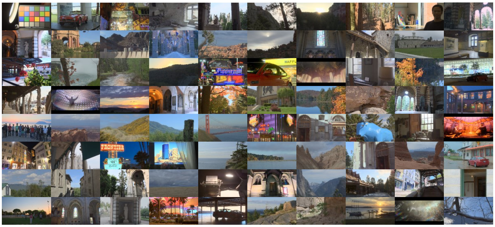
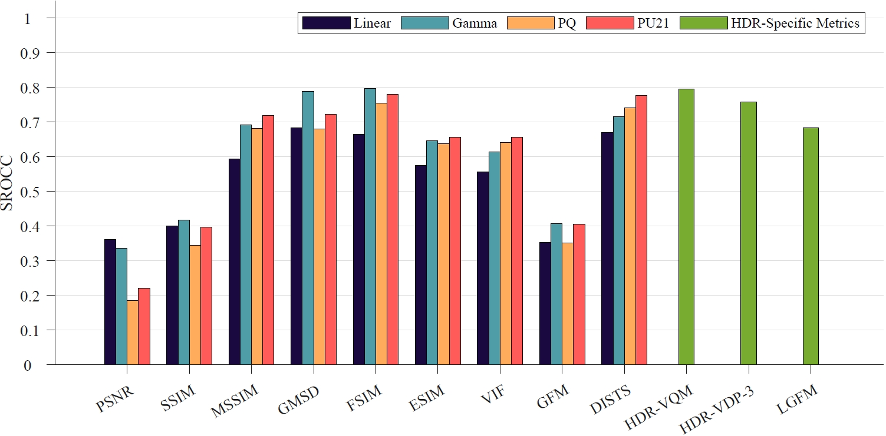
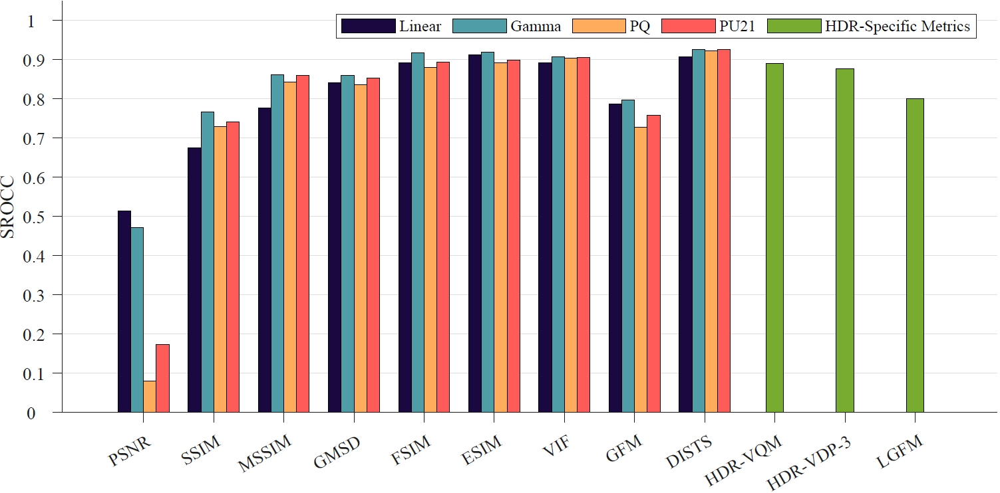

# HDRC: A Subjective Quality Assessment Database for Compressed High Dynamic Range Image [[Paper](https://link.springer.com/article/10.1007/s13042-024-02151-1)] 

**International Journal of Machine Learning and Cybernetics**

[Yue Liu](https://scholar.google.com.tw/citations?user=w6vLxPkAAAAJ&hl=zh-CN)<sup>1</sup>, [Zhangkai Ni](https://eezkni.github.io/)<sup>2</sup>, Peilin Chen<sup>1</sup>, [Shiqi Wang](https://www.cs.cityu.edu.hk/~shiqwang/)<sup>1</sup>, [Sam Kwong](https://scholar.google.com/citations?user=_PVI6EAAAAAJ&hl=zh-CN&oi=sra)<sup>3</sup>

<sup>1</sup>City University of Hong Kong, <sup>2</sup>Tongji University, <sup>3</sup>Lingnan Univerity

This repository provides the source dataset for the paper “HDRC: A Subjective Quality Assessment Database for Compressed High Dynamic Range Image”, IJMLC.

## About HDRC

Evaluating the quality of high dynamic range (HDR) images has emerged as a challenging and contemporary topic with the proliferation of HDR content. In this work, a new HDR compression (HDRC) database is proposed, aiming to provide a benchmark for the development of full-reference HDR image quality assessment (IQA) algorithms when facing the latest HDR compression distortions. In particular, the proposed HDRC database is the first HDR-IQA database to incorporate Versatile Video Coding (VVC) compression distortions, closely associated with practical application scenarios. Furthermore, the proposed HDRC database is currently the largest HDR-IQA database, including 80 reference images and 400 distorted images. Extensive experiments are conducted by studying the performance compared to existing HDR-IQA databases when evaluating three HDR-specific IQA models and nine IQA models prevalent for low dynamic range (LDR) content, revealing the challenges the proposed HDRC database brings. The results indicate that the existing IQA models demonstrate noticeable decreases in accuracy when assessing new compression distortions, underscoring the need for the development of novel HDR-IQA models. Consequently, the suggested HDRC database can serve as a potential database for HDR-IQA research, fostering a comprehensive exploration of the associated fields.


### The reference HDR images in the HDRC database
<!--  -->
<div align=center></div>


### Experimental Results
Performance evaluation of the state-of-the-art IQA metrics in terms of SROCC on the JPEG-XT compression distortion type in the proposed
HDRC database:
<div align=center></div>

Performance evaluation of the state-of-the-art IQA metrics in terms of SROCC on the VVC compression distortion type in the proposed
HDRC database:
<div align=center></div>

## HDRC dataset

- The dataset can be downloaded from [Google Drive](https://drive.google.com/file/d/1S_C6gGzRivOD-oZ52SzwToTB8_1Xq6rk/view?usp=sharing) or [Baidu Drive](https://pan.baidu.com/s/1pYg_JCPZh3R1naZGmVqOXg) (code: 9ncd).

## Citation

If you find our work useful, please cite it as

```
@article{liu2024hdrc,
  title={HDRC: a subjective quality assessment database for compressed high dynamic range image},
  author={Yue Liu, Zhangkai Ni, Peilin Chen, Shiqi Wang and Sam Kwong},
  journal={International Journal of Machine Learning and Cybernetics},
  pages={1--16},
  year={2024},
  publisher={Springer}
}
```

## Contact

Thanks for your attention! If you have any suggestion or question, feel free to leave a message here or contact Yue Liu (yliu724-c@my.cityu.edu.hk).


## License

[MIT License](https://opensource.org/licenses/MIT)

